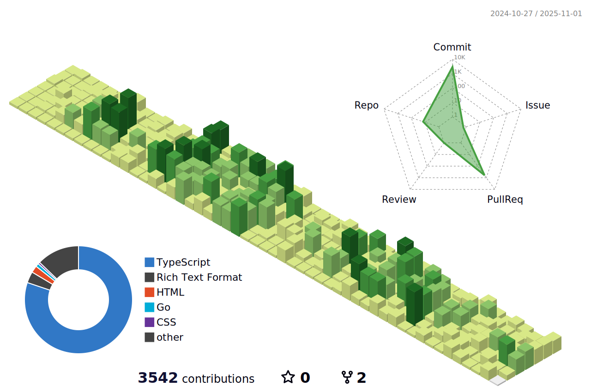

 

## Motto
  * 포기하지 않고 끝까지 간다면 웃는자가 된다.
  * 조바심에 사로잡혀 나약해 지지말자 
  * 목표 : GSAP 라이브러리 정복!
  
---

### Spotify Playing 🎧
 

---

## Language and Tools

  

 

 
 

